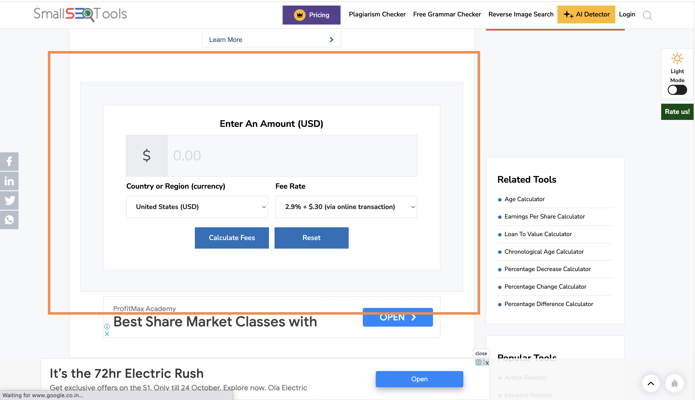

## PayPal Payments

**Procedure for Sending Money via PayPal and Calculating Transfer Fees**

1) To calculate the fees, visit [https://smallseotools.com/paypal-fee-calculator/](https://smallseotools.com/paypal-fee-calculator/) and locate the section shown in the image below. This PayPal calculator is the most accurate one I've found so far. I have encountered inaccuracies with others in the past, as they don't offer flexibility in choosing the Fee Rate.

2) Enter the amount in USD, in this case, $1000, and select the Fee Rate as 6.5% + $0.05 USD. Then, click on Calculate. This is the current fee rate for international payments. You can also verify the fee rate on the [PayPal website](https://www.paypal.com/in/webapps/mpp/merchant-fees). You will also find information in the dropdown menu. If the calculator is not working, please contact Pradumna.

3) After clicking Calculate, you will see the amount to send under "You should ask for," which, in this case, is $1069.57 USD. This is the amount you should transfer to the PayPal account.

If you have any questions, please contact Pradumna at pradumnasaraf@gmail.com.
